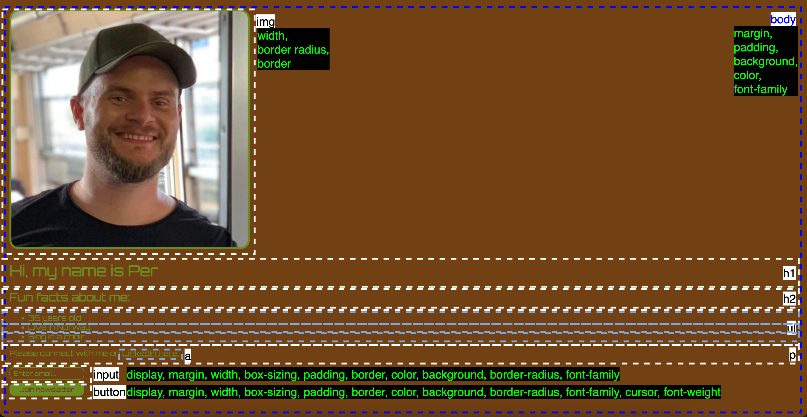

# Recap of what was learnt:
- Core HTML tags:
    - H1, H2, P tags

- Nesting:
    - How some tags are nested inside other tags, creating a tree structure

- `<button>` and `<input>` elements:
    - Makes the website interactive

- `<a>` element:
    - Allows developer to create links (with `<a href="link">Text</a>`)
    - Open webpage in new tab using (`target="_blank"`)

- HTML Document structure:
    - !doctype html, html, head, body tags

- List items:
    - ordered and unordered lists, with list items: `<ul>`, `<ol>`, `<li>`
    - description lists, with definition term and description: `<dl>`, `<dt>`, `<dd>`

- Deployment:
    - Netlify

# Breakdown of design:
