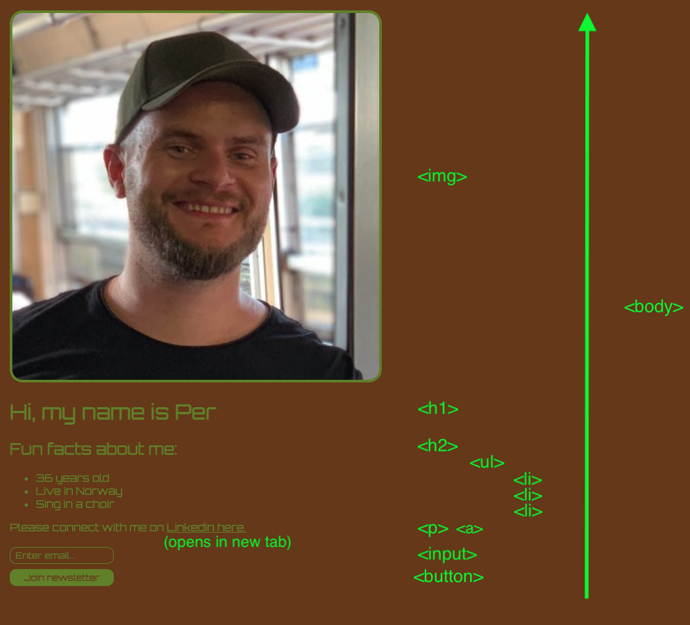

# Recap of what was learnt:
- Core HTML tags:
    - H1, H2, P tags
- Nesting:
    - How some tags are nested inside other tags, creating a tree structure
- Buttons and Input fields:
    - Makes the website interactive
- Anchor tags:
    - Allows developer to create links
- HTML Document structure:
    - !doctype html, html, head, body tags
- List items:
    - ordered and unordered lists, with list items
    - description lists
- Deployment:
    - Netlify

# Screenshot of project:
