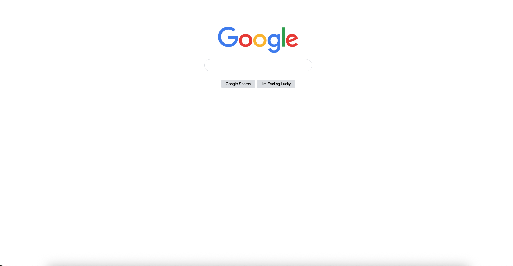

# Recap of what was learnt:
- CSS syntax:
    - select elements (using `.myClass` in css, `class="myClass" in html`), use properties and set values
    - reusable styling with `class`, specific styling wwith `id`

- Box model:
    - applies to Block-level, Inline-Block elements
    - Margins
        - create white space outside elements
    - Paddings
        - create white space inside elements
    - Borders
        - between paddings and margins
        - thickness, type, color, border radius
        - borders useful to recognise containers

- Div tags
    - wrap body and elements
    - typography inheritance from parent to children

- Inline vs Block vs Inline-Block vs Replaced elements:
    - Block-level
        - take full-width of parent container by default
        - always start on a new line
        - can set `width`, `height`, `margin`, `padding`, `border` freely
        - Examples: `
`, `
`, `<h1>-<h6>`, `<section>`, `<ul>, <li>`, `<form>`, `<header>`, `<footer>`
    - Inline
        - take only as much width as their content needs.
        - do not start a new line; sit next to other inline elements.
        - `width` and `height` are ignored, but horizontal padding and margin work; vertical padding/margin affects line spacing awkwardly.
        - Example: ``, `<a>`, `<strong>`, `<em>`, ``
    - Inline-block
        - behaves like inline (sits in line with text)
        - but acccepts box-model properties, for consistent widget sizing
        - can be used to line up elements horizontally without a parent wrapper.
        - Example: `<input>`, `<button>`, `<select>`, `<textarea>`
            -   Inline-block layouts were commonly used before Flexbox/Grid.
    - Replaced elements
        - content is not defined by HTML text, but an external source (image file, video, browser/OS widget, embedded document).
        - has intrinsic width/height from the content
        - Can override width/height/padding/margin with CSS.
        - Example: ``, `<video>`, `<audio>`, `<iframe>`, `<canvas>`, `<embed>`, `<object>`, `<input>`, `<button>`, `<select>`, `<textarea>`

- centering elements
    - block elements
        - set width, display: block (if not already default), margin left/right: auto
    - flexbox
        - add wrapper, `display: flex`, `justify-content: center`
- use inspect to see class styling in the browser

# Breakdown of design:
